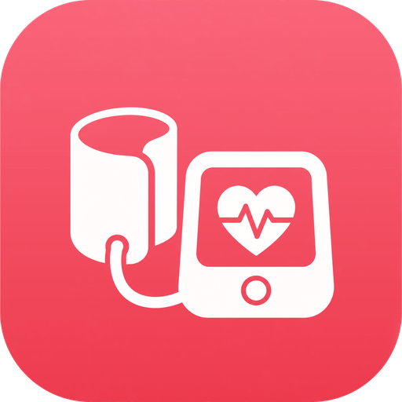

# 血圧ノート（Ketsuatsu）



血圧を記録・可視化する iOS アプリです。血圧計の表示を撮影すると、収縮期（上）・拡張期（下）・脈拍を自動で読み取って記録できます。

## 主な機能

### 📷 写真から自動入力
血圧計のディスプレイを撮影（または写真ライブラリから選択）すると、Vision の文字認識で数値を抽出して記録フォームに流し込みます。

- `SYS` / `DIA` / `PULSE`、`最高` / `最低` / `脈拍` などのラベルを優先して読み取り
- `128/82` のようなスラッシュ表記に対応
- ラベルが読めない機種では、数値の**表示位置と文字サイズ**から推定（上から 上 → 下 → 脈拍）
- 日付・時刻（`2024/10/25`、`07:35`）は測定値と取り違えないよう除外
- OCR が誤読しやすい文字（`O→0`、`l→1`、`S→5` など）を補正
- 1 回目で読めなければ、コントラストを強調した画像で自動リトライ（セグメント液晶対策）
- 読み取り結果は**必ず確認画面**を経由。確度と認識した生テキストも表示するので、その場で手直しできます
- **写真の撮影日時（Exif）を測定日時に採用**。あとから写真を選んでも、実際に測った時刻で記録されます（日時を手で直すと解除）
- **まとめて記録**: 写真を複数選ぶと一覧で読み取り結果を確認し、チェックしたぶんを一括保存できます

### 🗃 まとめて記録
血圧計の写真を撮りためている場合、まとめて登録できます。

- 写真ライブラリから最大 20 枚まで選択（読み取り時間とメモリを考えた上限）
- 1 枚ずつ順に読み取り、終わったものから一覧に反映（進み具合を表示）
- 各行で 上/下/脈拍・撮影日時・確度を確認、タップして修正
- 読み取れなかった写真は自動で除外し、手入力すれば記録対象に復帰
- チェックしたぶんだけを一括保存（ヘルスケア連携も同時に実行）

### 📝 記録
- 上・下・脈拍（キーボード入力と ± ボタンの両対応）
- 測定日時、時間帯（朝／昼／晩／その他・時刻から自動判定）、測定した腕、服薬の有無、メモ
- 撮影した写真も記録に添付（設定でオフ可）
- 日本高血圧学会ガイドライン（JSH2019）に基づく判定を入力中にリアルタイム表示

### ⏰ リマインダー
1 日に何回でも通知を設定できます（既定は朝 7:00 / 昼 13:00 / 晩 21:00 の 1 日 3 回）。

- **まとめて設定**: すべての曜日で同じ時刻に通知
- **曜日ごとに設定**: 曜日を選んでその日の時刻を編集（例：平日は朝だけ、土日は朝昼晩）
  - ある曜日の時刻を「すべての曜日 / 平日 / 土日」へコピー可能
  - 曜日ごとの設定回数を一覧で確認できる
- かんたん設定（1 日 2 回・1 日 3 回）をワンタップで適用
- 時刻ごとに時間帯（朝／昼／晩）を持ち、通知文と記録の初期値に反映
- 時刻単位でオン／オフ、スワイプで削除
- 「まとめて」→「曜日ごと」に切り替えると、現在の時刻を全曜日へ引き継ぎ
- 通知の許可状態を画面上で確認・誘導
- iOS の保留通知の上限（アプリごとに 64 件）に配慮し、60 件を超える設定では警告を表示（超過分は 1 日の早い時刻を優先して登録）

### ❤️ ヘルスケア連携
- 記録の保存時に血圧（相関サンプル）と心拍数をヘルスケアへ自動で書き出し
- ヘルスケアからの取り込み（過去 1 年ぶん、自アプリが書いたデータと重複は除外）
- 記録の編集・削除にヘルスケア側も追従
- 未同期の記録をまとめて書き出す機能

### 📊 グラフ・集計
**期間**: 1週間 / 1か月 / 3か月 / 半年 / 1年 / 全期間 / 期間指定（開始日と終了日を選択）

**表示する系列**: 平均 / 朝 / 昼 / 晩 / すべて
- 「平均」はその期間のすべての測定をならした値
- 朝・昼・晩はその時間帯の記録だけを抜き出して推移を確認
- 「すべて」は 1 回ごとの測定値を点で表示

期間の長さに応じて、平均をまとめる単位（日ごと → 週ごと → 月ごと）と横軸の目盛りを自動で切り替えるので、1 年や全期間でも点が潰れません。

- 血圧の推移＋目標値ライン、脈拍の推移
- 平均・最高・最低・測定回数・目標達成率・高血圧域の割合（選んだ系列で集計）
- 判定区分ごとの内訳
- 時間帯（朝・昼・晩）ごとの平均と朝晩差（モーニングサージの目安）
- ホームには先週比のトレンドを表示

### 🗂 その他
- 日付ごとにまとめた履歴、検索と絞り込み（期間・時間帯）
- CSV 書き出し（Excel でも文字化けしない BOM 付き）
- 目標値・判定基準（家庭血圧／診察室血圧）の設定
- 全データ削除

## セットアップ

必要環境:

- Xcode 16 以降（フォルダ同期グループを使っています）
- iOS 17.0 以降の実機または シミュレータ

```sh
open Ketsuatsu.xcodeproj
```

実機で動かすときは、Xcode の **Signing & Capabilities** で自分の Team を選んでください。バンドル ID の既定値は `com.example.Ketsuatsu` です。HealthKit の Capability は `Config/Ketsuatsu.entitlements` に含まれています。

> カメラはシミュレータでは使えません。写真ライブラリからの読み取りで動作を確認できます。

### テスト

```sh
xcodebuild test -scheme Ketsuatsu -destination 'platform=iOS Simulator,name=iPhone 16'
```

OCR の解析ロジック（`BPTextParser`）、判定区分、集計、CSV、リマインダーの計算に単体テストがあります。

## 構成

```
Ketsuatsu/
├── App/            アプリのエントリポイントとタブ構成
├── Models/         記録・下書き・判定区分・集計・設定
├── Services/
│   ├── OCR/        Vision による文字認識と血圧値の解析
│   ├── HealthKitService    ヘルスケアの読み書き
│   ├── ReminderStore       リマインダーの保存と通知登録
│   ├── RecordService       保存・削除とヘルスケア同期の入口
│   └── CSVExporter         CSV 書き出し
├── Views/          画面（ホーム / 履歴 / グラフ / 設定 / 記録 / 撮影）
└── Utilities/      日付や数値の書式
```

技術的なポイント:

- **SwiftUI + SwiftData**（iOS 17 の `@Observable` / `@Query`）
- **Swift Charts** でグラフを描画
- OCR の解析は Vision に依存しない純粋なロジック（`OCRTextItem` を入力に取る）として切り出しているため、実機の写真がなくてもテストできます
- 集計は `BPMeasurement` プロトコル越しに動くので、SwiftData のモデルでもプレーンな構造体でも同じコードで扱えます

## デザイン

アプリアイコン（コーラルレッドのグラデーション＋白い血圧計）を基準に、画面全体の配色をそろえています。定義は `Ketsuatsu/Utilities/Theme.swift` の 1 か所にまとめてあります。

| 用途 | 色 |
| --- | --- |
| ブランド（アイコン上端） | `#FA657A` |
| ブランド（中央・アクセントカラー） | `#F35064` |
| ブランド（下端） | `#ED3B4E` |
| 収縮期（上） | ブランドカラー |
| 拡張期（下） | `#3F7BD8` |
| 脈拍 | `#FF8FA3` |

- ホームの最新記録カードはアイコンと同じ斜めグラデーション＋白抜き文字
- 判定区分は 緑 → 琥珀 → コーラル（アイコンと同色）→ ベリー の段階配色
- カードとボタンの角丸はアイコンに合わせた連続曲線（`style: .continuous`）
- アイコン画像は `AppMark` として画面内でも使用（空状態・設定画面・ナビゲーションバー）

アイコンを差し替える場合は `Ketsuatsu/Assets.xcassets/AppIcon.appiconset/AppIcon.png`（1024×1024・全面塗り）と `AppMark.imageset/AppMark.png`（角丸・透過）を置き換え、`Theme.swift` の 3 色を新しいアイコンから採色し直してください。

## 判定基準について

日本高血圧学会「高血圧治療ガイドライン 2019」の分類を使っています。家庭血圧と診察室血圧では基準が 5mmHg 異なるため、設定で切り替えられます（既定は家庭血圧）。

| 区分 | 家庭血圧 | 診察室血圧 |
| --- | --- | --- |
| 正常血圧 | < 115 かつ < 75 | < 120 かつ < 80 |
| 正常高値血圧 | 115–124 かつ < 75 | 120–129 かつ < 80 |
| 高値血圧 | 125–134 または 75–84 | 130–139 または 80–89 |
| I 度高血圧 | 135–144 または 85–89 | 140–159 または 90–99 |
| II 度高血圧 | 145–159 または 90–99 | 160–179 または 100–109 |
| III 度高血圧 | ≥ 160 または ≥ 100 | ≥ 180 または ≥ 110 |

## 免責

このアプリは医療機器ではありません。記録と傾向の把握を助けるものであり、診断・治療の判断は医師にご相談ください。写真からの読み取り結果は必ず画面でご確認ください。
